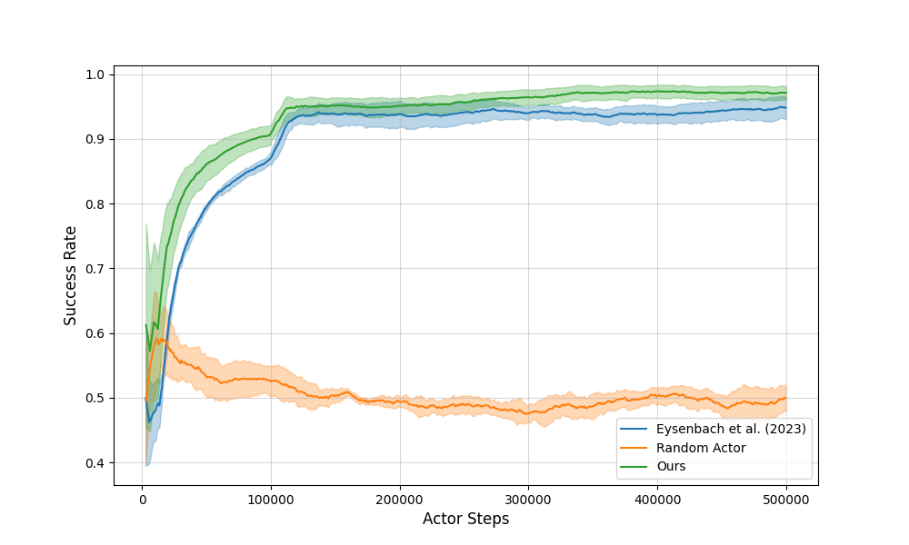

# Analyzing and Simplifying Contrastive Reinforcement Learning

Repository of my master thesis including implementation of experiments.
The implementation is based on Eysenbach et al. (2023) "Contrastive Learning as Goal-Conditioned Reinforcement Learning" (https://ben-eysenbach.github.io/contrastive_rl/).

## Abstract

> **Abstract:**  
> [This work builds on a novel approach by Eysenbach et al. (2023) that directly learns representations to solve goal-conditioned reinforcement learning (RL) tasks. Using contrastive learning on online trajectories, state-action and goal representations are trained to capture temporal correlations, allowing the critic to approximate a goal-conditioned Q-function. This method integrates RL and representation learning into a single, self-supervised objective, eliminating the need for a reward function.

We conduct an in-depth analysis of this approach, termed contrastive reinforcement learning (CRL), visualizing its representation space and critic. Our findings support CRL's claims that its representations capture the environment's actionable structure. We also show that replacing the original algorithm's parameterized actor with a greedy actor during training leads to faster learning, higher final performance, and reduced training time, though at the cost of increased inference time. Attempts to simplify CRL further using a single encoder were unsuccessful.

Our results provide insights into CRL's workings and suggest that it can be further simplified and improved by focusing on its core idea of learning a critic that directly solves goal-conditioned RL tasks.]

## Important Graph

---

Feel free to explore the repository for more details on the implementation and findings of my research. For any questions or discussions, please don't hesitate to reach out via the repository's issues section or by contacting me directly.
